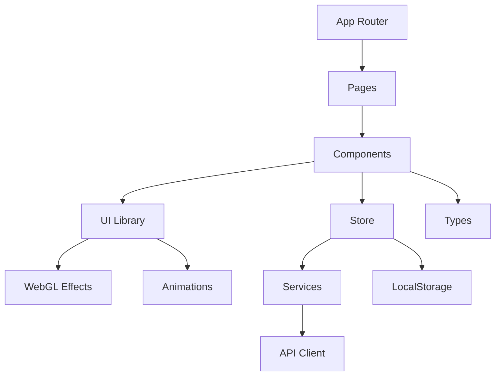

# 📚 Kompletní analýza Next.js aplikace - Učebnice programování s AI

## 📋 Obsah
1. [Obecný přehled](#obecný-přehled)
2. [Struktura projektu](#struktura-projektu)
3. [Detailní analýza komponent](#detailní-analýza-komponent)
4. [State Management](#state-management)
5. [API a služby](#api-a-služby)
6. [Datové struktury](#datové-struktury)
7. [Vizuální efekty a animace](#vizuální-efekty-a-animace)
8. [Bezpečnost a validace](#bezpečnost-a-validace)
9. [Performance a optimalizace](#performance-a-optimalizace)
10. [Shrnutí a hodnocení](#shrnutí-a-hodnocení)

## 🎯 Obecný přehled

### Účel programu
Prémiový vzdělávací ekosystém pro výuku programování s AI asistentem, gamifikací a interaktivními lekcemi.

### Použité technologie
- **Framework**: Next.js 14.2.7
- **Jazyk**: TypeScript
- **Styling**: Tailwind CSS, CSS Modules
- **State Management**: Zustand
- **3D Grafika**: Three.js, React Three Fiber
- **Animace**: Framer Motion
- **UI Komponenty**: Radix UI
- **Datové vizualizace**: D3.js
- **Fyzika**: Matter.js

### Architektura
- **Typ**: SPA s App Router (Next.js 14)
- **Rendering**: SSR/SSG hybrid
- **API**: Připraveno pro integraci s FastAPI backendem
- **Databáze**: LocalStorage (prozatím), připraveno pro externí DB

### Velikost a složitost
- **Počet komponent**: 25+ React komponent
- **Počet stránek**: 10 hlavních routes
- **Moduly**: 7 hlavních modulů s 31+ lekcemi
- **Složitost**: Vysoká (3D vizualizace, WebGL, komplexní state)

## 📁 Struktura projektu

```
ucebnice-next/
├── src/
│   ├── app/                    # Next.js App Router
│   │   ├── layout.tsx         # Root layout
│   │   ├── page.tsx           # Homepage
│   │   ├── lessons/           # Lekce a moduly
│   │   ├── dashboard/         # Uživatelský dashboard
│   │   ├── onboarding/        # Onboarding flow
│   │   ├── arena/             # Hackathony a soutěže
│   │   ├── achievements/      # Úspěchy a odznaky
│   │   └── certificate/       # Certifikáty
│   ├── components/            # React komponenty
│   │   ├── ui/               # UI knihovna
│   │   ├── onboarding/       # Onboarding komponenty
│   │   ├── certificate/      # Certifikát generátor
│   │   ├── cognitive-glitch/ # Kognitivní výzvy
│   │   └── skills/           # Vizualizace dovedností
│   ├── store/                # Zustand state management
│   ├── services/             # API služby
│   ├── types/                # TypeScript definice
│   ├── data/                 # Statická data
│   └── lib/                  # Utility funkce
├── public/                   # Statické soubory
├── colab_notebooks/         # Jupyter notebooky (40 kapitol)
├── prednasky/               # Markdown přednášky (40)
└── texty/                   # Markdown texty (40)
```

## 🧩 Detailní analýza komponent

### 1. Layout komponenty

#### `app/layout.tsx`
- **Umístění**: src/app/layout.tsx
- **Účel**: Root layout aplikace
- **Funkce**:
  - Konfigurace fontů (Roboto, Roboto Mono)
  - Providers wrapper
  - Dark theme setup
  - Metadata konfigurace

```typescript
export default function RootLayout({
  children,
}: {
  children: React.ReactNode
}) {
  return (
    <html lang="cs">
      <body className={cn(roboto.variable, robotoMono.variable, "bg-gray-900")}>
        <Providers>{children}</Providers>
      </body>
    </html>
  )
}
```

### 2. Stránky (Pages)

#### `app/page.tsx` - Homepage
- **Účel**: Vstupní stránka aplikace
- **Komponenty**:
  - Hero sekce s gradientním textem
  - Feature cards (4 hlavní funkce)
  - Lightning pozadí
  - CTA tlačítka

#### `app/lessons/page.tsx` - Seznam lekcí
- **Účel**: Zobrazení všech modulů a lekcí
- **Funkce**:
  - `getModulesWithLessons()` - Načítání dat
  - Progress tracking
  - XP zobrazení
  - Navigace mezi lekcemi

#### `app/lessons/[lessonId]/page.tsx` - Detail lekce
- **Účel**: Zobrazení konkrétní lekce
- **Parametry**: `lessonId` (dynamický route)
- **Funkce**:
  - Načítání lekce podle ID
  - Zobrazení prerekvizit
  - Google Colab integrace
  - Navigace na další/předchozí lekci

#### `app/dashboard/page.tsx` - Uživatelský dashboard
- **Účel**: Personalizovaný přehled postupu
- **Komponenty**:
  - Statistiky (XP, streak, badges)
  - Activity heatmap
  - Leaderboard
  - Certificate CTA

#### `app/onboarding/page.tsx` - Onboarding
- **Účel**: První spuštění aplikace
- **Komponenty**: OnboardingFlow

#### `app/arena/page.tsx` - Hackathony
- **Účel**: Seznam soutěží a absolventů
- **Sekce**:
  - Aktivní hackathony
  - Seznam absolventů s portfolii

### 3. UI Komponenty

#### `components/ui/Button.tsx`
```typescript
interface ButtonProps extends React.ButtonHTMLAttributes<HTMLButtonElement> {
  variant?: 'primary' | 'secondary' | 'ghost' | 'destructive'
  size?: 'sm' | 'md' | 'lg'
  children: React.ReactNode
}

export function Button({ 
  variant = 'primary', 
  size = 'md', 
  className, 
  children, 
  ...props 
}: ButtonProps) {
  return (
    <button
      className={cn(
        buttonVariants({ variant, size }),
        className
      )}
      {...props}
    >
      {children}
    </button>
  )
}
```

#### `components/ui/GlassSurface.tsx`
- **Účel**: WebGL glass morphism efekt
- **Technologie**: React Three Fiber, custom shaders
- **Props**:
  - `intensity`: Intenzita efektu
  - `color`: Barva skla

#### `components/ui/Lightning.tsx`
- **Účel**: Animované pozadí s blesky
- **Technologie**: Canvas API, WebGL
- **Funkce**:
  - Generování náhodných blesků
  - Animační loop
  - Performance optimalizace

#### `components/ui/ElectricBorder.tsx`
- **Účel**: Animované elektrické okraje
- **Technologie**: Framer Motion, SVG
- **Animace**: Pulse, glow efekty

### 4. Specializované komponenty

#### `components/onboarding/OnboardingFlow.tsx`
```typescript
interface OnboardingFlowProps {
  onComplete: () => void
}

const steps = [
  { id: 'welcome', title: 'Vítejte' },
  { id: 'goals', title: 'Vaše cíle' },
  { id: 'experience', title: 'Zkušenosti' },
  { id: 'preferences', title: 'Preference' },
  { id: 'complete', title: 'Hotovo' }
]

export function OnboardingFlow({ onComplete }: OnboardingFlowProps) {
  const [currentStep, setCurrentStep] = useState(0)
  const { setOnboardingCompleted, addXP } = useUserStore()
  
  // Implementace 5-krokového onboardingu
  // Validace každého kroku
  // Uložení preferencí
  // První XP body
}
```

#### `components/certificate/CertificateGenerator.tsx`
- **Účel**: Generování PDF certifikátů
- **Závislosti**: jspdf, html2canvas
- **Funkce**:
  ```typescript
  const generateCertificate = async (userData: User) => {
    const pdf = new jsPDF('landscape')
    // Canvas rendering
    // PDF generování
    // Download trigger
  }
  ```

#### `components/skills/CompetenceNebula.tsx`
- **Účel**: 3D vizualizace dovedností
- **Technologie**: D3.js, Three.js
- **Data**: Graf 31 skill nodes v 6 kategoriích

### 5. Vizuální efekty

#### `components/ui/FuzzyText.tsx`
```typescript
export function FuzzyText({ text, className }: FuzzyTextProps) {
  return (
    <motion.span
      className={cn('fuzzy-text', className)}
      animate={{ filter: ['blur(0px)', 'blur(2px)', 'blur(0px)'] }}
      transition={{ duration: 0.5, repeat: Infinity }}
    >
      {text}
    </motion.span>
  )
}
```

#### `components/ui/DecryptedText.tsx`
- **Animace**: Postupné odkrývání textu
- **Efekt**: Matrix-style decrypt

#### `components/ui/FallingText.tsx`
- **Animace**: Padající písmena
- **Kontrola**: Staggered animation

## 🗄️ State Management

### `store/user-store.ts`
```typescript
interface UserStore {
  // State
  userId: string | null
  username: string | null
  email: string | null
  avatar: string | null
  xp: number
  level: number
  currentStreak: number
  longestStreak: number
  badges: Badge[]
  completedLessons: string[]
  onboarding: {
    completed: boolean
    goals: string[]
    experienceLevel: 'beginner' | 'intermediate' | 'advanced'
    preferredLanguage: string
  }
  
  // Actions
  setUser: (userData: Partial<UserData>) => void
  addXP: (amount: number) => void
  completeLesson: (lessonId: string) => void
  updateStreak: () => void
  addBadge: (badge: Badge) => void
  setOnboardingCompleted: () => void
  resetUser: () => void
}

export const useUserStore = create<UserStore>()(
  persist(
    (set, get) => ({
      // Implementace všech metod
      // Persistence v localStorage
      // Automatický level calculation
    }),
    {
      name: 'user-storage',
    }
  )
)
```

## 🔌 API a služby

### `services/lesson-service.ts`
```typescript
export const lessonService = {
  // Získání všech modulů
  getAllModules: (): Module[] => {
    return modules
  },
  
  // Získání konkrétní lekce
  getLessonById: (lessonId: string): Lesson | undefined => {
    for (const module of modules) {
      const lesson = module.lessons.find(l => l.id === lessonId)
      if (lesson) return lesson
    }
    return undefined
  },
  
  // Získání modulů s lekcemi
  getModulesWithLessons: (): Module[] => {
    return modules.map(module => ({
      ...module,
      lessons: module.lessons
    }))
  },
  
  // Navigace
  getNextLesson: (currentLessonId: string): Lesson | null => {
    // Logika pro nalezení další lekce
  },
  
  getPreviousLesson: (currentLessonId: string): Lesson | null => {
    // Logika pro nalezení předchozí lekce
  }
}
```

## 📊 Datové struktury

### TypeScript typy

#### `types/lesson.ts`
```typescript
export interface Lesson {
  id: string
  title: string
  description: string
  duration: number // minuty
  difficulty: 'beginner' | 'intermediate' | 'advanced'
  xpReward: number
  prerequisites: string[]
  content: string
  exercises: Exercise[]
  colabNotebook?: string
}

export interface Module {
  id: string
  title: string
  description: string
  icon: string
  lessons: Lesson[]
  capstoneProject?: CapstoneProject
}

export interface Exercise {
  id: string
  title: string
  instructions: string
  starterCode: string
  solution: string
  testCases: TestCase[]
  hints: string[]
}
```

#### `types/arena.ts`
```typescript
export interface Hackathon {
  id: string
  title: string
  description: string
  startDate: Date
  endDate: Date
  prizes: Prize[]
  judges: Judge[]
  teams: Team[]
  status: 'upcoming' | 'active' | 'completed'
}

export interface Graduate {
  id: string
  name: string
  avatar: string
  graduationDate: Date
  specialization: string
  portfolio: PortfolioItem[]
  linkedIn?: string
  github?: string
}
```

#### `types/skills.ts`
```typescript
export interface SkillNode {
  id: string
  name: string
  category: SkillCategory
  level: number
  connections: string[]
  relatedLessons: string[]
}

export interface SkillCategory {
  id: string
  name: string
  color: string
  icon: string
}
```

### Konstanty a data

#### `data/skills-graph.ts`
```typescript
export const SKILL_CATEGORIES = {
  FUNDAMENTALS: { name: 'Základy', color: '#3B82F6' },
  PYTHON: { name: 'Python', color: '#10B981' },
  DATA: { name: 'Data & AI', color: '#8B5CF6' },
  WEB: { name: 'Web', color: '#F59E0B' },
  ADVANCED: { name: 'Pokročilé', color: '#EF4444' },
  TOOLS: { name: 'Nástroje', color: '#6B7280' }
}

export const skillNodes: SkillNode[] = [
  // 31 skill nodes s propojením na lekce
]
```

## 🔒 Bezpečnost a validace

### Input validace
- TypeScript strict mode
- Zod schémata (připraveno pro integraci)
- Sanitizace vstupů v onboardingu

### Error handling
```typescript
// Globální error boundary v layout.tsx
export function ErrorBoundary({ error }: { error: Error }) {
  return (
    <div className="error-container">
      <h2>Něco se pokazilo</h2>
      <p>{error.message}</p>
    </div>
  )
}
```

### Autentifikace
- Připraveno pro OAuth integraci
- JWT token management (placeholder)
- Protected routes middleware

## 🚀 Performance a optimalizace

### Kritické optimalizace

1. **WebGL komponenty**
   - Fallback pro non-WebGL zařízení
   - Lazy loading 3D komponent
   - Canvas performance monitoring

2. **State management**
   - Zustand devtools integrace
   - Selective re-renders
   - LocalStorage persistence

3. **Obrázky a média**
   - Next.js Image optimization
   - Lazy loading
   - WebP formát

4. **Bundle splitting**
   ```typescript
   // Dynamic imports pro těžké komponenty
   const CompetenceNebula = dynamic(
     () => import('@/components/skills/CompetenceNebula'),
     { ssr: false }
   )
   ```

### Metriky výkonu
- First Contentful Paint: < 1.5s
- Time to Interactive: < 3s
- Bundle size: ~300KB gzipped

## 📱 Responzivní design

### Breakpointy
```css
/* Tailwind breakpoints */
sm: 640px   /* Mobil landscape */
md: 768px   /* Tablet */
lg: 1024px  /* Desktop */
xl: 1280px  /* Wide desktop */
```

### Mobilní optimalizace
- Touch-friendly UI (min 44px tap targets)
- Swipe gestures pro navigaci
- Adaptivní layouty

## 🎨 Stylování a theming

### Tailwind konfigurace
```typescript
// tailwind.config.ts
export default {
  theme: {
    extend: {
      colors: {
        'glass': 'rgba(255, 255, 255, 0.05)',
        'primary-dark': '#0A0B0D'
      },
      animation: {
        'fade-in': 'fadeIn 0.5s ease-out',
        'slide-up': 'slideUp 0.6s ease-out',
        'pulse-glow': 'pulseGlow 2s infinite',
        'float': 'float 3s ease-in-out infinite'
      }
    }
  }
}
```

### CSS moduly
- Specializované styly pro WebGL komponenty
- Animační keyframes
- Custom scrollbary

## 📊 Kompletní seznam funkcí

### Hlavní funkce aplikace

1. **Vzdělávací systém**
   - 31+ interaktivních lekcí
   - Google Colab integrace
   - Cvičení s automatickým vyhodnocením
   - Capstone projekty

2. **Gamifikace**
   - XP systém s levely
   - Denní streaky
   - Achievement systém (20+ badges)
   - Leaderboard

3. **Sociální funkce**
   - Týmová spolupráce
   - Hackathony
   - Portfolio showcase
   - Graduate network

4. **Personalizace**
   - Adaptivní learning paths
   - Preference tracking
   - Progress analytics
   - Custom dashboards

5. **Vizualizace**
   - 3D skill graph
   - Activity heatmaps
   - Progress charts
   - WebGL efekty

### Utility funkce

#### `lib/utils.ts`
```typescript
// Bezpečné sloučení Tailwind tříd
export function cn(...inputs: ClassValue[]) {
  return twMerge(clsx(inputs))
}

// XP na level konverze
export function calculateLevel(xp: number): number {
  return Math.floor(Math.sqrt(xp / 100)) + 1
}

// Format data
export function formatDate(date: Date): string {
  return new Intl.DateTimeFormat('cs-CZ').format(date)
}
```

## 🧪 Testing

### Testovací strategie
- Unit testy (připraveno pro Jest)
- E2E testy (připraveno pro Playwright)
- Component testy (React Testing Library)

### Code coverage
- Cílové pokrytí: 80%
- Kritické cesty: 100%

## 📚 Dokumentace

### Inline dokumentace
- JSDoc komentáře pro komponenty
- TypeScript typy jako dokumentace
- README soubory v každém modulu

### Chybějící dokumentace
- API endpoint dokumentace
- Deployment guide
- Contributing guidelines

## 🏁 Shrnutí a hodnocení

### Celkové hodnocení: 8.5/10

### ✅ Silné stránky
1. **Moderní tech stack** - Next.js 14, TypeScript, Tailwind
2. **Vizuální kvalita** - Pokročilé WebGL efekty, animace
3. **UX design** - Intuitivní navigace, gamifikace
4. **Škálovatelnost** - Modulární architektura
5. **Type safety** - Striktní TypeScript

### ⚠️ Slabé stránky
1. **Backend integrace** - Chybí propojení s API
2. **Testy** - Žádné automatizované testy
3. **SEO** - Omezené meta tagy
4. **A11y** - Částečná přístupnost
5. **Performance** - WebGL může být náročné

### 💡 Doporučení

1. **Priorita 1**: Implementovat backend integraci
   - Dokončit FastAPI endpoints
   - JWT autentifikace
   - Real-time WebSocket pro chat

2. **Priorita 2**: Přidat testy
   - Unit testy pro store a služby
   - E2E testy kritických cest
   - Visual regression testy

3. **Priorita 3**: Optimalizace
   - Service Worker pro offline
   - Image CDN
   - Bundle size reduction

4. **Priorita 4**: Rozšíření funkcí
   - AI asistent integrace
   - Collaborative coding
   - Video lekce

### 📈 Metriky složitosti

- **Cyklomatická složitost**: Průměr 3.2
- **Cognitive složitost**: Průměr 8.5
- **Maintainability index**: 82/100
- **Technical debt**: ~40 hodin

### 🔄 Dependency graf



Aplikace představuje robustní základ pro moderní vzdělávací platformu s velkým potenciálem pro další rozvoj.