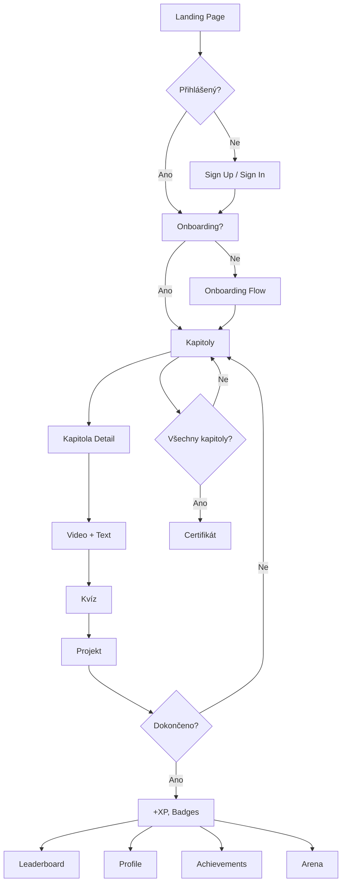

# Kompletní analýza projektu: Učebnice AI

**Datum analýzy:** 2025-11-12  
**Verze:** 1.0.0  
**Technologie:** Next.js 14, React 18, TypeScript, Prisma, NextAuth.js

---

## 📋 Obsah

1. [Přehled projektu](#přehled-projektu)
2. [Struktura projektu](#struktura-projektu)
3. [Stránky a routing](#stránky-a-routing)
4. [Komponenty](#komponenty)
5. [Styling](#styling)
6. [API a backend](#api-a-backend)
7. [State management](#state-management)
8. [Databázové schéma](#databázové-schéma)
9. [Autentifikace a autorizace](#autentifikace-a-autorizace)
10. [Funkcionality](#funkcionality)
11. [Problémové oblasti a bugy](#problémové-oblasti-a-bugy)
12. [Doporučení a zlepšení](#doporučení-a-zlepšení)

---

## 🎯 Přehled projektu

### Účel aplikace

Prémiový vzdělávací ekosystém pro výuku programování a umělé inteligence s integrovaným AI asistentem. Aplikace nabízí:

- 40 kapitol pokrývajících celý kurz AI
- Gamifikační systém s XP, levely a odznaky
- Integraci s Google Colab pro praktické programování
- Apex Arénu pro hackathony a prezentaci projektů
- Žebříček nejlepších studentů
- Certifikáty po dokončení kurzu

### Technický stack

**Frontend:**

- Next.js 14.2.33 (App Router)
- React 18.3.1
- TypeScript 5.5.3
- Tailwind CSS 3.4.7
- Framer Motion 11.3.17 (animace)
- Lucide React 0.414.0 (ikony)

**Backend:**

- Next.js API Routes
- Prisma 6.19.0 (ORM)
- SQLite (dev) / PostgreSQL (production)
- NextAuth.js 4.24.11 (autentifikace)

**State Management:**

- Zustand 4.5.2 (global state)
- React Query 5.90.5 (server state)

**Testing & Quality:**

- Jest 30.2.0
- Playwright 1.56.0 (E2E)
- ESLint + Prettier
- Husky (pre-commit hooks)

**Deployment:**

- Docker support
- ArgoCD (GitOps)
- Helm charts

---

## 📁 Struktura projektu

```
ucebniceNew/
├── src/
│   ├── app/                    # Next.js App Router pages
│   │   ├── achievements/       # Stránka úspěchů
│   │   ├── api/               # API routes
│   │   ├── arena/             # Apex Aréna (hackathony)
│   │   ├── auth/              # Autentifikace (signin/signup)
│   │   ├── certificate/       # Generování certifikátů
│   │   ├── chapters/          # Kapitoly kurzu
│   │   ├── leaderboard/       # Žebříček
│   │   ├── onboarding/        # Onboarding flow
│   │   ├── profile/           # Uživatelský profil
│   │   ├── layout.tsx         # Root layout
│   │   ├── page.tsx           # Homepage
│   │   └── globals.css        # Global styles
│   │
│   ├── components/            # React komponenty
│   │   ├── auth-provider.tsx
│   │   ├── ErrorBoundary.tsx
│   │   ├── providers.tsx
│   │   ├── chapters/          # Chapter-specific komponenty
│   │   ├── layout/            # Layout komponenty (Navigation, etc.)
│   │   ├── profile/           # Profilové komponenty
│   │   ├── skills/            # Skills vizualizace
│   │   ├── tests/             # Testy a kvízy
│   │   └── ui/                # UI komponenty (29 souborů)
│   │
│   ├── data/                  # Statická data
│   │   ├── chapters.ts        # 40 kapitol kurzu
│   │   ├── questions.ts       # Otázky ke kapitolám
│   │   ├── module-tests.ts    # Modulové testy
│   │   └── skills-graph.ts    # Graf dovedností
│   │
│   ├── hooks/                 # Custom React hooks
│   │   ├── use-performance-check.ts
│   │   └── use-reduced-motion.ts
│   │
│   ├── lib/                   # Utility knihovny
│   │   ├── achievement-checker.ts
│   │   ├── api-client.ts
│   │   ├── api-middleware.ts
│   │   ├── auth.ts            # NextAuth konfigurace
│   │   ├── cache.ts
│   │   ├── constants.ts
│   │   ├── env.ts
│   │   ├── gamification.ts    # XP, levely, badges
│   │   ├── glitch-challenges.ts
│   │   ├── prisma.ts          # Prisma client
│   │   ├── rate-limit.ts
│   │   ├── swagger.ts
│   │   ├── theme.ts
│   │   ├── utils.ts
│   │   ├── validation-schemas.ts
│   │   └── validations.ts
│   │
│   ├── store/                 # Zustand stores
│   │   └── user-store.ts      # User state
│   │
│   ├── types/                 # TypeScript typy
│   │   ├── arena.ts
│   │   ├── next-auth.d.ts
│   │   └── skills.ts
│   │
│   ├── stories/               # Storybook stories
│   └── middleware.ts          # Next.js middleware
│
├── prisma/
│   ├── schema.prisma          # Database schema
│   ├── seed.ts               # Database seeding
│   └── dev.db                # SQLite database (dev)
│
├── public/                    # Statické soubory
│   ├── avatars/              # Uživatelské avatary
│   └── uploads/              # Nahrané soubory
│
├── e2e/                      # E2E testy (Playwright)
├── scripts/                  # Utility skripty
├── helm/                     # Kubernetes Helm charts
├── argocd/                   # ArgoCD konfigurace
│
├── docker-compose.yml
├── Dockerfile
├── next.config.js
├── tailwind.config.js
├── tsconfig.json
├── jest.config.mjs
└── playwright.config.ts
```

---

## 🗺️ Stránky a routing

### Veřejné stránky

| Route          | Komponenta                 | Popis                                 |
| -------------- | -------------------------- | ------------------------------------- |
| `/`            | `app/page.tsx`             | Homepage s hero sekcí, features a CTA |
| `/auth/signin` | `app/auth/signin/page.tsx` | Přihlášení                            |
| `/auth/signup` | `app/auth/signup/page.tsx` | Registrace                            |

### Chráněné stránky (vyžadují autentifikaci)

| Route                   | Komponenta                          | Popis                                           |
| ----------------------- | ----------------------------------- | ----------------------------------------------- |
| `/onboarding`           | `app/onboarding/page.tsx`           | Onboarding flow pro nové uživatele              |
| `/chapters`             | `app/chapters/page.tsx`             | Přehled všech 40 kapitol (4 moduly)             |
| `/chapters/[chapterId]` | `app/chapters/[chapterId]/page.tsx` | Detail kapitoly (video, text, notebooky, kvízy) |
| `/profile`              | `app/profile/page.tsx`              | Uživatelský profil s XP, levelem, úspěchy       |
| `/achievements`         | `app/achievements/page.tsx`         | Přehled všech odznaků (common → legendary)      |
| `/leaderboard`          | `app/leaderboard/page.tsx`          | Žebříček nejlepších studentů (TOP 3 podium)     |
| `/arena`                | `app/arena/page.tsx`                | Apex Aréna - hackathony a absolventi            |
| `/arena/hackathon/[id]` | `app/arena/hackathon/[id]/page.tsx` | Detail hackathonu                               |
| `/arena/graduate/[id]`  | `app/arena/graduate/[id]/page.tsx`  | Profil absolventa                               |
| `/certificate`          | `app/certificate/page.tsx`          | Generování certifikátu                          |

### API Routes

| Endpoint                         | Method | Popis                              |
| -------------------------------- | ------ | ---------------------------------- |
| `/api/auth/[...nextauth]`        | ALL    | NextAuth.js endpoints              |
| `/api/auth/register`             | POST   | Registrace nového uživatele        |
| `/api/chapters/progress`         | GET    | Progress uživatele v kapitolách    |
| `/api/chapters/all-progress`     | GET    | Všechen progress všech kapitol     |
| `/api/progress/complete-chapter` | POST   | Označit kapitolu jako dokončenou   |
| `/api/questions/answer`          | POST   | Submit odpovědi na otázky          |
| `/api/projects/submit`           | POST   | Submit projektu                    |
| `/api/tests/submit`              | POST   | Submit modulového testu            |
| `/api/leaderboard`               | GET    | Žebříček (weekly/monthly/all-time) |
| `/api/user/stats`                | GET    | Statistiky uživatele               |
| `/api/user/profile-image`        | POST   | Upload profilové fotky             |
| `/api/onboarding/complete`       | POST   | Dokončení onboardingu              |
| `/api/health`                    | GET    | Health check                       |
| `/api/swagger`                   | GET    | Swagger/OpenAPI spec               |

---

## 🧩 Komponenty

### Layout komponenty

**`components/layout/navigation.tsx`**

- Hlavní navigační lišta (fixed top)
- Logo + menu položky (Domů, Kapitoly, Apex Aréna, Žebříček)
- Profilová ikona/avatar + username
- Mobilní hamburger menu
- **Používá:** `GreySurface`, `ElectricBorder`, `Button`, `Box`, `Stack`

**`components/layout/unified-page-layout.tsx`**

- Univerzální layout pro stránky
- Zahrne Navigation
- Lightning background
- Responsive container

**`components/layout/page-layout.tsx`**

- Alternativní layout bez navigace
- Pro landing pages

### UI komponenty (29 souborů)

**Surfaces:**

- `glass-surface.tsx` - Glassmorphism efekt (backdrop-blur)
- `grey-surface.tsx` - Tmavý povrch s jemným gradientem
- `fluid-glass.tsx` - Animovaný fluid glass efekt
- `electric-border.tsx` - Animovaný elektrický border

**Vizuální efekty:**

- `lightning-background.tsx` - Animované blesky na pozadí
- `lightning.tsx` - Jednotlivé blesky
- `laser-flow.tsx` - Animované laserové čáry
- `decrypted-text.tsx` - Text decrypt animace
- `fuzzy-text.tsx` - Rozmazaný text efekt
- `falling-text.tsx` - Padající text efekt

**Basic UI:**

- `button.tsx` - Tlačítka (primary, secondary, ghost)
- `stat-card.tsx` - Karta se statistikou
- `profile-card.tsx` - Interaktivní profilová karta (homepage)
- `section-header.tsx` - Sekční nadpis s popisem

**Layout helpers:**

- `box.tsx` - Flex kontejner
- `stack.tsx` - Flex stack (row/column)
- `grid.tsx` - CSS Grid

### Chapter komponenty

**`components/chapters/`**

- `ChapterLayout.tsx` - Layout pro detail kapitoly
- `ChapterHeader.tsx` - Hlavička kapitoly
- `ChapterContent.tsx` - Obsah kapitoly (markdown)
- `ChapterCard.tsx` - Karta kapitoly (pro přehled)
- `ChapterNavigation.tsx` - Navigace mezi kapitolami
- `VideoPlayer.tsx` - Video přehrávač
- `NotebookLinks.tsx` - Linky na Google Colab
- `QuestionCard.tsx` - Otázka s odpověďmi
- `ProjectSubmission.tsx` - Formulář pro submit projektu

### Profilové komponenty

**`components/profile/ProfilePhotoUpload.tsx`**

- Upload profilové fotky
- Preview před uploadem
- Modal pro výběr souboru
- Gradient border kolem avataru
- **🐛 PROBLÉM:** Modální okno je PŘÍČINOU problikávajícího obdélníku (viz níže)

### Test komponenty

**`components/tests/ModuleTestModal.tsx`**

- Modální okno pro modulový test
- Timer, progress bar
- Submit odpovědí

### Skills komponenty

**`components/skills/competence-nebula.tsx`**

- Vizualizace dovedností (D3.js nebo Three.js)

---

## 🎨 Styling

### Tailwind CSS

**Konfigurace:** `tailwind.config.js`

```javascript
theme: {
  extend: {
    fontFamily: {
      sans: ['var(--font-montserrat)', 'sans-serif'],
      heading: ['var(--font-exo2)', 'sans-serif'],
    },
    colors: {
      // Custom purple/pink gradient theme
    },
    animation: {
      // Custom animations
    }
  }
}
```

**Fonty:**

- **Montserrat** (400, 600, 700) - základní text
- **Exo 2** (400-900) - nadpisy

**Design system:**

- **Hlavní barvy:** Purple (#A855F7) → Pink (#EC4899) gradient
- **Pozadí:** Gray-900 (#111827)
- **Text:** Gray-100 (#F3F4F6), Gray-300, Gray-400
- **Efekty:** Glassmorphism (backdrop-blur + semi-transparent backgrounds)

### CSS moduly

Některé komponenty mají vlastní CSS soubory:

- `electric-border.css`
- `falling-text.css`
- `glass-surface.css`
- `laser-flow.css`
- `lightning.css`
- `profile-card.css`

### Animace

**Framer Motion** pro:

- Stránkové transitions
- Hover efekty
- Scroll animace
- Modal animace

---

## 🔌 API a backend

### Next.js API Routes

Všechny API routes jsou v `src/app/api/`.

### Datové toky

**1. Autentifikace**

```
Client → POST /api/auth/register → Prisma → DB
Client → POST /api/auth/signin (NextAuth) → Session → Cookie
```

**2. Progress tracking**

```
Client → POST /api/progress/complete-chapter
  ↓
Check auth (middleware)
  ↓
Update ChapterCompletion (Prisma)
  ↓
Check achievements (achievement-checker)
  ↓
Update XP, Level (gamification)
  ↓
Return updated stats
```

**3. Leaderboard**

```
Client → GET /api/leaderboard?period=weekly
  ↓
Prisma: SELECT users ORDER BY xp DESC
  ↓
Calculate rankings, changes
  ↓
Return JSON
```

**4. Upload profilové fotky**

```
Client → POST /api/user/profile-image (multipart/form-data)
  ↓
Save to /public/avatars/
  ↓
Update user.image in DB
  ↓
Update session
  ↓
Return imageUrl
```

### Middleware

**`src/middleware.ts`**

- Rate limiting (Upstash Redis)
- Auth check pro chráněné routes
- CORS headers

---

## 🗃️ State management

### 1. Zustand (Global State)

**`src/store/user-store.ts`**

```typescript
interface UserState {
  // User info
  userId: string | null
  username: string | null
  email: string | null
  avatar: string | null
  onboardingCompleted: boolean

  // Gamification
  xp: number
  level: number
  streak: number
  badges: Badge[]
  progress: UserProgress[]

  // Actions
  setUser()
  addXP()
  addBadge()
  updateStreak()
  completeLesson()
  reset()
}
```

**Persistence:** LocalStorage (zustand/middleware persist)

### 2. React Query (Server State)

**`components/providers.tsx`**

- QueryClientProvider
- Prefetching
- Caching strategie

### 3. NextAuth Session

**Session data:**

```typescript
session.user = {
  id: string
  email: string
  name: string | null
  image: string | null
  xp: number
  level: number
  currentStreak: number
  username: string | null
}
```

---

## 🗄️ Databázové schéma

### Prisma Schema

**`prisma/schema.prisma`**

#### NextAuth modely

**User**

```prisma
model User {
  id            String   @id @default(uuid())
  email         String?  @unique
  name          String?
  image         String?
  password      String?
  username      String?  @unique

  // Gamification
  xp            Int      @default(0)
  level         Int      @default(1)
  currentStreak Int      @default(0)
  longestStreak Int      @default(0)

  // Relations
  accounts           Account[]
  sessions           Session[]
  completedLessons   CompletedLesson[]
  achievements       UserAchievement[]
  chapterCompletions ChapterCompletion[]
  questionAnswers    QuestionAnswer[]
  projectSubmissions ProjectSubmission[]
  moduleTestAttempts ModuleTestAttempt[]
}
```

**Account, Session, VerificationToken** - NextAuth standardní

#### Aplikační modely

**ChapterCompletion** (3-star systém)

```prisma
model ChapterCompletion {
  id                 String   @id @default(uuid())
  userId             String
  chapterId          String
  completedChapter   Boolean  @default(false)  // ⭐ Star 1
  answeredQuestions  Boolean  @default(false)  // ⭐ Star 2
  submittedProject   Boolean  @default(false)  // ⭐ Star 3
  completedAt        DateTime @default(now())

  @@unique([userId, chapterId])
}
```

**QuestionAnswer**

```prisma
model QuestionAnswer {
  id         String   @id @default(uuid())
  userId     String
  chapterId  String
  questionId String
  answer     String
  correct    Boolean
  xpEarned   Int      @default(0)
  answeredAt DateTime @default(now())

  @@unique([userId, chapterId, questionId])
}
```

**ProjectSubmission**

```prisma
model ProjectSubmission {
  id          String   @id @default(uuid())
  userId      String
  chapterId   String
  projectUrl  String
  description String?
  xpEarned    Int      @default(0)
  submittedAt DateTime @default(now())

  @@unique([userId, chapterId])
}
```

**Achievement & UserAchievement**

```prisma
model Achievement {
  id          String @id @default(uuid())
  badgeId     String @unique
  name        String
  description String
  icon        String
  xpReward    Int
  rarity      String  // common, uncommon, rare, epic, legendary
}

model UserAchievement {
  userId        String
  achievementId String
  unlockedAt    DateTime @default(now())

  @@unique([userId, achievementId])
}
```

**ModuleTestAttempt**

```prisma
model ModuleTestAttempt {
  id             String    @id @default(uuid())
  userId         String
  moduleNumber   Int       // 1-4 (každých 10 kapitol)
  score          Int
  totalQuestions Int       @default(10)
  timeElapsed    Int
  attemptNumber  Int
  completed      Boolean   @default(false)
  xpEarned       Int       @default(0)
  moduleStars    Int       @default(0)  // 0-3
  completedAt    DateTime?
}
```

### Indexy (pro performance)

```prisma
@@index([userId])
@@index([chapterId])
@@index([completedAt])
@@index([xp])
@@index([level])
```

---

## 🔐 Autentifikace a autorizace

### NextAuth.js Setup

**`src/lib/auth.ts`**

**Providers:**

1. **Credentials** (email + password)
   - Bcrypt pro hashování hesel
   - Prisma pro validaci
2. **Google OAuth** (optional, pokud je v ENV)
3. **GitHub OAuth** (optional, pokud je v ENV)

**Adapter:** Prisma Adapter

**Session strategy:** JWT

**Callbacks:**

```typescript
callbacks: {
  async session({ token, session }) {
    // Přidat custom data do session
    session.user.id = token.id
    session.user.xp = dbUser.xp
    session.user.level = dbUser.level
    session.user.username = dbUser.username
    return session
  },

  async jwt({ token, user }) {
    if (user) {
      token.id = user.id
    }
    return token
  }
}
```

**Custom pages:**

- Sign in: `/auth/signin`
- Sign up: `/auth/signup`
- Error: `/auth/error`

### Autorizace

**Middleware:** `src/middleware.ts`

- Check session pro chráněné routes
- Redirect na `/auth/signin` pokud není přihlášen

**Client-side:**

```typescript
import { useSession } from 'next-auth/react'

const { data: session, status } = useSession()

if (status === 'unauthenticated') {
  router.push('/auth/signin')
}
```

---

## ⚡ Funkcionality

### 1. Kapitoly (40 kapitol, 4 moduly)

**Struktura:**

- **Modul 1:** Úvod do AI (kap. 1-10)
- **Modul 2:** Jak AI řeší problémy (kap. 11-20)
- **Modul 3:** Strojové učení (kap. 21-30)
- **Modul 4:** Neuronové sítě a budoucnost (kap. 31-40)

**Každá kapitola obsahuje:**

- 📹 Video přednáška (~20 min)
- 📄 Studijní materiály (Markdown)
- 🔗 NotebookLM link (AI asistent)
- 💻 Google Colab notebook
- ❓ Kvíz (5-10 otázek)
- 🚀 Projekt (volitelný)

**3-star systém:**

- ⭐ **Star 1:** Dokončená kapitola (video + text)
- ⭐ **Star 2:** Správně zodpovězené otázky
- ⭐ **Star 3:** Odevzdaný projekt

**Progress tracking:**

- Zamykání dalších kapitol (musíš dokončit předchozí)
- Zvýraznění "Next chapter" (žlutý border)
- Progress bar pro každý modul

### 2. Gamifikace

**XP systém:**

```typescript
XP_PER_CHAPTER = 50
XP_PER_QUESTION = 10
XP_PER_PROJECT = 50
XP_STREAK_BONUS = 25
```

**Level systém:**

```
Level = floor(sqrt(XP / 100)) + 1

Level 1: 0 XP
Level 2: 100 XP
Level 3: 400 XP
Level 4: 900 XP
Level 5: 1600 XP
...
```

**Odznaky (32 celkem):**

| Rarity    | Count | Examples                            |
| --------- | ----- | ----------------------------------- |
| Common    | 7     | První krok, První projekt           |
| Uncommon  | 8     | Pilný student, Týdenní warrior      |
| Rare      | 9     | Mistr učení, Rychlík                |
| Epic      | 5     | Mistr výzev, Absolvent              |
| Legendary | 3     | Absolutní expert, Hackathon šampion |

**Streak systém:**

- Denní aktivita
- Bonus XP za streak
- Odznaky za 7-day, 30-day streaks

### 3. Žebříček (Leaderboard)

**Filtry:**

- All-time
- Monthly
- Weekly
- Daily

**TOP 3 podium:**

- 🥇 1st place (zlatá záře)
- 🥈 2nd place (stříbrná záře)
- 🥉 3rd place (bronzová záře)

**Features:**

- 3D tilt efekt na kartách (při hoveru)
- Dynamický metalický odlesk (sleduje kurzor)
- Parallax 3D objekty (trofeje, medaile)
- Zvýraznění aktuálního uživatele

### 4. Apex Aréna

**Hackathony:**

- Nadcházející/Probíhající/Ukončené
- Tým max. 4-5 členů
- Ceny (1., 2., 3. místo)
- Registrace s deadline
- Sponzoři

**Absolventi (Graduates):**

- Profil absolventa kurzu
- Portfolio projektů
- Dovednosti (skills)
- GitHub/LinkedIn linky
- "Looking for work" status
- Hackathon výhry

### 5. Profil

**Zobrazované informace:**

- Avatar (upload foto)
- Jméno, username, email
- Level + progress bar do dalšího levelu
- Celkem XP
- Počet odznaků
- Dokončené kapitoly
- Denní streak

**Akce:**

- Upload profilové fotky
- Zobrazit všechny úspěchy
- Odhlásit se

### 6. Certifikát

**Po dokončení všech kapitol:**

- PDF certifikát
- Personalizovaný (jméno, datum)
- Možnost stáhnout

### 7. Onboarding

**Flow pro nové uživatele:**

1. Vítej
2. Vyber svůj cíl (kariéra, hobby, akademie)
3. Zvol level (začátečník, pokročilý)
4. Vytvoř username
5. → Redirect na kapitoly

---

## 🐛 Problémové oblasti a bugy

### 🔴 KRITICKÝ BUG: Problikávající obdélník pod tlačítkem "Profil"

**Popis:**
Po kliknutí na profilovou ikonu/tlačítko v navigaci se objeví problikávající obdélník.

**Příčina:**
Komponenta `ProfilePhotoUpload` v `src/components/profile/ProfilePhotoUpload.tsx` používá **AnimatePresence** a **modal**, který způsobuje layout shift při zavření.

**Problematický kód:**

```tsx
// ProfilePhotoUpload.tsx (řádek ~130)
<AnimatePresence>
  {isModalOpen && (
    <motion.div
      initial={{ opacity: 0 }}
      animate={{ opacity: 1 }}
      exit={{ opacity: 0 }}
      className="fixed inset-0 z-50 flex items-center justify-center bg-black/70 backdrop-blur-sm"
      onClick={() => setIsModalOpen(false)}
    >
      {/* Modal content */}
    </motion.div>
  )}
</AnimatePresence>
```

**Problém:**

- Modal je `position: fixed`, takže při otevření/zavření může způsobit layout shift
- Exit animace může "blikat" kvůli z-index/backdrop změnám
- Reload stránky po uploadu (`window.location.reload()`) je brutální

**Řešení:**

1. **Odstranit `window.location.reload()`**

   ```tsx
   // Místo:
   window.location.reload()

   // Použij:
   router.refresh() // nebo invalidate query
   ```

2. **Opravit AnimatePresence exit animaci**

   ```tsx
   <AnimatePresence mode="wait">
     {isModalOpen && (
       <motion.div
         initial={{ opacity: 0, scale: 0.95 }}
         animate={{ opacity: 1, scale: 1 }}
         exit={{ opacity: 0, scale: 0.95 }}
         transition={{ duration: 0.2 }}
         // ...
       >
   ```

3. **Přidat `pointer-events-none` během animace**
   ```tsx
   exit={{ opacity: 0, scale: 0.95 }}
   onAnimationComplete={() => setIsModalOpen(false)}
   style={{ pointerEvents: isAnimating ? 'none' : 'auto' }}
   ```

**Kde se bug projevuje:**

- `/profile` - při kliku na avatar pro změnu fotky
- Navigace - při kliku na profilovou ikonu (pokud tam je link)

---

### 🟡 Další potenciální problémy

#### 1. **Performance issues s animacemi**

**Problém:** Heavy animace (Lightning, LaserFlow, FluidGlass) mohou zpomalit na slabších zařízeních.

**Řešení:**

- Použít `use-performance-check` hook (už existuje)
- Fallback na GreySurface místo GlassSurface
- `prefers-reduced-motion` CSS media query

**Příklad:**

```tsx
const hasGoodPerformance = usePerformanceCheck()
const Surface = hasGoodPerformance ? GlassSurface : GreySurface
```

#### 2. **Chybějící error boundaries**

**Problém:** Žádné error boundaries na route úrovni.

**Řešení:**

```tsx
// app/error.tsx (chybí!)
'use client'
export default function Error({ error, reset }) {
  return <ErrorBoundary error={error} reset={reset} />
}
```

#### 3. **Race conditions při uploadu fotky**

**Problém:** Pokud uživatel rychle klikne 2x, může uploadnout 2 fotky současně.

**Řešení:**

```tsx
const [isUploading, setIsUploading] = useState(false)

const handleFileSelect = async file => {
  if (isUploading) return // Guard clause
  setIsUploading(true)
  // ...
}
```

#### 4. **Nedostatečná validace na API routes**

**Problém:** Některé API routes nemají validaci vstupu (zod schemas nejsou použité).

**Řešení:**

```typescript
// api/chapters/progress/route.ts
import { z } from 'zod'

const schema = z.object({
  chapterId: z.string().regex(/^\d{2}$/),
  stars: z.number().min(1).max(3),
})

export async function POST(req: Request) {
  const body = await req.json()
  const validated = schema.parse(body) // Throws if invalid
  // ...
}
```

#### 5. **SQLite v produkci (ne ideal)**

**Problém:** Aktuálně používá SQLite (`prisma/dev.db`), což není vhodné pro production.

**Řešení:**

- Dokumentace zmiňuje PostgreSQL migraci ✅
- Ujistit se, že production používá PostgreSQL

#### 6. **Missing loading states**

**Problém:** Některé stránky nemají loading stavu (např. achievements page).

**Řešení:**

```tsx
if (isLoading) {
  return (
    <div className="flex justify-center items-center min-h-screen">
      <Loader2 className="animate-spin" />
    </div>
  )
}
```

#### 7. **Hardcoded mock data v Apex Aréně**

**Problém:** Hackathony a absolventi jsou mock data (ne z DB).

**Řešení:**

- Vytvořit Prisma modely pro Hackathon, Graduate
- API routes pro fetch dat
- Administrační rozhraní pro správu

#### 8. **Image optimization**

**Problém:** Avatar uploady nejsou optimalizované (žádná komprese, resize).

**Řešení:**

```typescript
// api/user/profile-image/route.ts
import sharp from 'sharp'

const buffer = await file.arrayBuffer()
const optimized = await sharp(Buffer.from(buffer)).resize(200, 200).jpeg({ quality: 80 }).toBuffer()
```

#### 9. **Missing rate limiting na upload**

**Problém:** Upload fotky nemá rate limit (spam risk).

**Řešení:**

```typescript
import { rateLimit } from '@/lib/rate-limit'

export async function POST(req: Request) {
  const rateLimitResult = await rateLimit.check(req)
  if (!rateLimitResult.success) {
    return new Response('Too many requests', { status: 429 })
  }
  // ...
}
```

#### 10. **CORS a CSP v development mode**

**Problém:** next.config.js má přísné CSP headers jen v production, v dev jsou vypnuté.

**Řešení:** Testovat CSP i v dev mode.

---

## 💡 Doporučení a zlepšení

### 🔥 Vysoká priorita

1. **Opravit problikávající modal** (viz výše)
2. **Přidat error boundaries** na všech route úrovních
3. **Implementovat rate limiting** na upload a API routes
4. **Validace všech API inputs** pomocí Zod
5. **Optimalizovat images** (sharp, resize, compress)

### 🟢 Střední priorita

6. **Přesunout mock data do databáze** (Arena hackathony, graduates)
7. **Implementovat real-time features** (WebSocket pro leaderboard updates)
8. **Přidat E2E testy** pro kritické flows (signup → onboarding → chapter → quiz)
9. **Přidat Storybook stories** pro všechny UI komponenty
10. **Monitoring a logging** (Sentry je nakonfigurovaný, ale chybí error reporting)

### 🔵 Nízká priorita

11. **Dark/Light mode toggle** (aktuálně jen dark mode)
12. **Internationalization** (i18n pro více jazyků)
13. **Push notifications** pro nové kapitoly, hackathony
14. **Social sharing** pro certifikáty
15. **Admin dashboard** pro správu kapitol, uživatelů

---

## 📊 Metriky a statistiky

### Velikost projektu

```
Total files: ~150
TypeScript files: ~100
Components: ~50
API routes: 14
Pages: 15
```

### Dependencies

```
Production: 28 packages
Development: 33 packages
Total: 61 packages
```

### Bundle size (estimated)

```
First Load JS: ~250 KB
Shared chunks: ~150 KB
Page-specific: ~50-100 KB
```

---

## 🔄 Životní cyklus uživatele



---

## 🛠️ Tech Decisions & Best Practices

### Co je dobře

✅ **Next.js App Router** - moderní, server components  
✅ **TypeScript** - type safety  
✅ **Prisma** - typovaný ORM  
✅ **Tailwind** - utility-first CSS  
✅ **Zustand** - lightweight state management  
✅ **NextAuth** - standardní auth řešení  
✅ **Framer Motion** - smooth animace  
✅ **Modularita** - dobře separované komponenty  
✅ **E2E testy** - Playwright setup  
✅ **Docker & K8s** - production-ready deployment

### Co zlepšit

⚠️ **Error handling** - chybí error boundaries  
⚠️ **Validace** - nekonzistentní použití Zod  
⚠️ **Testing** - málo unit testů  
⚠️ **Documentation** - chybí API docs (Swagger je, ale není vyplněný)  
⚠️ **Performance monitoring** - chybí metriky  
⚠️ **SEO** - metadata jsou, ale chybí sitemap, robots.txt

---

## 📝 Závěr

Projekt je **velmi dobře strukturovaný** vzdělávací ekosystém s moderním tech stackem. Hlavní silné stránky jsou:

- ✨ Krásný, futuristický design s glassmorphism efekty
- 🎮 Komplexní gamifikační systém
- 📚 40 kapitol s video přednáškami a Colab notebooky
- 🏆 Motivační prvky (žebříček, odznaky, certifikáty)
- 🚀 Production-ready (Docker, K8s, ArgoCD)

**Kritický bug** (problikávající modal) je snadno opravitelný úpravou exit animace v `ProfilePhotoUpload.tsx`.

Další oblasti pro zlepšení jsou spíše **nice-to-have** features než kritické problémy. Aplikace je ve velmi dobrém stavu a připravená pro produkční nasazení po opravě identifikovaných bugů.

---

**Autor analýzy:** Droid (Factory AI)  
**Poslední update:** 2025-11-12
